```{r setup, include=FALSE}

library(flexdashboard)
library(DT)
library(tidyverse)
library(tibble)
library(htmltools)
library(htmlwidgets)
library(tibble)
library(shiny)
library(httr)
library(paletteer)
library(bslib)

```

```{r carregando dados, include = FALSE}


#Carregando dados

dados_expo <- read_csv2('dados/expos_aves_2.csv', locale = locale(encoding = "ISO-8859-1"))

```

# Home

## Column {data-width="400"}

### **Do you like watching birds?**

<center>

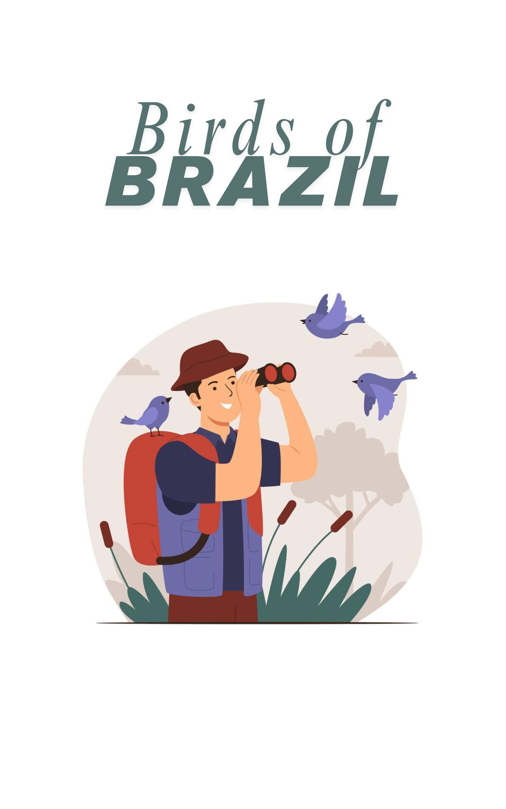{width="80%" height="60%"}

</center>


## Column {data-width="460"}

### **How about getting familiar with some Brazilian species?**

{width="350"}


### **Learn about some birds of Brazil**


<center>

<!-- [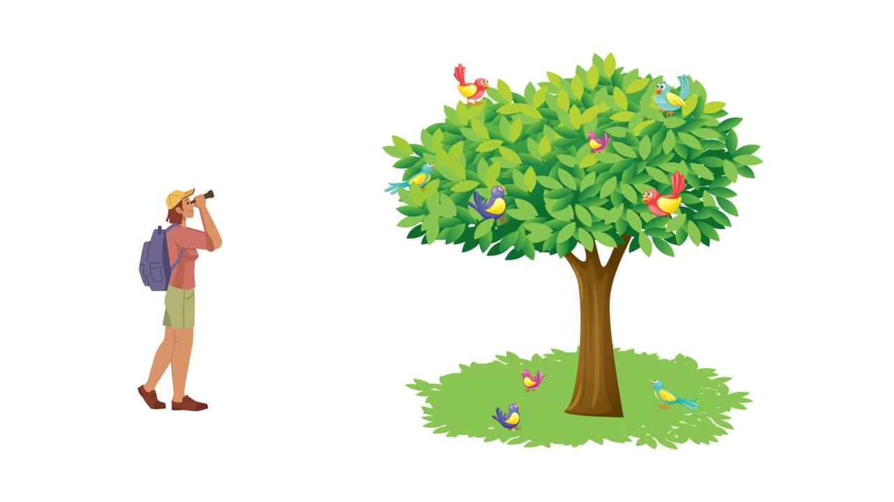{width="100%" height="100%"}](https://www.gov.br/icmbio/pt-br) -->

{width="80%" height="80%"}


```{r}

# # A imagem dispara um input do Shiny
# tags$a(
#   href = "#", 
#   onclick = "Shiny.setInputValue('go_page', 'Brazilian Birds');",
#   tags$img(src = "figs/imagem_entrada.jpg",
#            style = "cursor:pointer; border:2px solid #444; max-width:100%; height:auto;")
# )

```

```{r2}

# # Código reativo para trocar de página
# observeEvent(input$go_page, {
#   updateNavset("navpage", selected = "Brazilian Birds")
# })
# 

```


<br>

</center>

## Column {data-width="140"}

### Bird species in Brazil

```{r}

valueBox(1900, color = "#2C2182")
```

### Bird species in Kazakhstan
```{r}

valueBox(545, color = "#0A52b9")
```

### Bird species in the World

```{r}

valueBox(11500, color = "#004173")
```

### Bird species in Europe

```{r}

valueBox(700, color = "#004173")
```

### Bird species in Asia

```{r}

valueBox(3850, color = "#004173")
```

### Bird species in Oceania

```{r}

valueBox(1300, color = "#004173")
```

### Bird species in Americas

```{r}


valueBox(6000, color = "#004173")
```

### Bird species in North America

```{r}


valueBox(1150, color = "#004173")
```

### Bird species in South America

```{r}

valueBox(3300, color = "#004173")

```


# Brazilian Birds

## Barra Lateral {.sidebar}

```{r gerando a lista das espécies, include = FALSE}


# cnaa_especie <- dados_cnaa %>%
#     group_by(especie_CBRO, campanha, local, imagem, audio, video) %>%
#     summarise(soma = sum(registros))
# 
# 
# #especies <- c(unique(dados_cnaa$especie), "Todas") # excluindo a opção "Todas"
# especies <- sort(c(unique(dados_cnaa$especie_CBRO))) # ordenando os valores
# especies <- especies[c(-23, -28)] # excluindo Tringa spp e Sterna spp
# especies
 
```


```{r gerando a lista das espécies 1, include = FALSE}

expo_especies <- dados_expo
especies <- sort(c(unique(expo_especies$nome_comum_ingles))) # ordenando os valores


```


```{r criando o painel de seleção 1, echo = FALSE}

inputPanel(selectInput("especie", label = h4("Choose a bird:"),
                        choices = especies),
                        selected = "Horned Screamer")
                       

# actionButton("Atualizar","Atualizar")

#dados <- eventReactive(input$Atualizar,{dados_monitora1 %>% 
         #filter(str_detect(UC, if_else(input$UC == 'Todas',"",input$UC)))})

# cnaa_especie %>%
# filter(str_detect(especies, if_else(input$especie == 'Todas',"",input$especie)))

```

## Column {data-width="450"}

### **First image**


<center>

```{r apresenta a imagem da espécie selecionada, echo = FALSE}

# ---------------- Método de mostrar a imagem pelo browser ------- função renderUI()

# renderUI({
# 
# 
#   imagens_ave <-
#     tibble::tibble(
#       cnaa_especie %>%
#         #filter(especie_CBRO == "Ardea alba")
#         filter(especie_CBRO == input$especie))
# 
#     url <- imagens_ave[1 , 4]  |>
#       pull(imagem)
# 
#     img(
#       src = url,
#       width = "100%")
# 
# })


   
# ------------------ Método de baixar o arquivo da imagem - função renderImage()----------------


# renderImage({
   
#  imagens_ave <-
#      tibble::tibble(
#        cnaa_especie %>%
#          #filter(especie_CBRO == "Ardea alba")) 
#          filter(especie_CBRO == input$especie))  
#        
#       url <-  imagens_ave[1 , 4] |> 
#         pull(imagem)
# 
#       arquivo <- tempfile(fileext = ".png")
#       httr::GET(url, httr::write_disk(arquivo, overwrite = TRUE))
#       #download.file(url, arquivo)
#      
#      list(
#        src = arquivo,
#        width = "100%"
#      )
# })

```


```{r apresenta a imagem da espécie selecionada 2, echo = FALSE}

# ---------------- Método de mostrar a imagem pelo browser ------- função renderUI()

# renderUI({
# 
# 
#   imagens_ave <-
#     tibble::tibble(
#       expo_especies %>%
#         #filter(nome_comum_ingles == "Horned Screamer"))
#         filter(nome_comum_ingles == input$especie))

    # arquivo <- imagens_ave %>% pull(imagem)
    # 
    # 
    #  img(
    #    src = file.path("www", arquivo),
    #    width = "100%")
     
     
  #     # Pega o arquivo correspondente
  # file_name <- imagens_ave %>% pull(mapa) %>% .[1]
  # 
  # # Mostra a imagem (Shiny serve automaticamente a pasta www/)
  # tags$img(src = file_name, width = "100%")
  
  

    # url <- imagens_ave [1 , 6]  %>%
    #   pull(mapa)
    # 
    # 
    # img(
    #   src = url,
    #   width = "100%")
    
    
    
  #   file_name <- imagens_ave [1 , 5] %>%
  #     pull(imagem)
  # 
  # # Caminho relativo dentro da pasta www/
  # url <- file_name  # se está direto em www/
  # # url <- file.path("aves", file_name) # se está em subpasta "www/aves/"
  # 
  # img(src = url, width = "100%")


#})


# ------------------------------------


# renderUI({
# 
#   imagem_ave <-
#     tibble::tibble(
#       expo_especies %>%
#         #filter(especie_CBRO == "Ardea alba")
#         filter(nome_comum_ingles == input$especie))
# 
#   url <- imagem_ave[1, 6] %>%   # supondo que a coluna 6 tem a URL da imagem
#     pull(mapa)
# 
#   tags$img(
#     src = url,
#     width = "100%",   # ajusta automaticamente à largura do container
#     height = "auto",
#     alt = "Imagem da espécie"
#   )
# 
# })

# ------------------ Método de baixar o arquivo da imagem - função 

# renderImage({
# 
#  imagens_ave <-
#      tibble::tibble(
#        expo_especies %>%
#          #filter(especie_CBRO == "Ardea alba"))
#          filter(nome_comum_ingles == input$especie))
# 
#       url <-  imagens_ave[1 , 5] |>
#         pull(imagem)
# 
#       arquivo <- tempfile(fileext = ".JPG")
#       httr::GET(url, httr::write_disk(arquivo, overwrite = TRUE))
#       download.file(url, arquivo)
# 
#      list(
#        src = arquivo,
#        width = "100%"
#      )
# })


renderUI({

  imagem_ave <-
    tibble::tibble(
      expo_especies %>%
        #filter(especie_CBRO == "Ardea alba")
        filter(nome_comum_ingles == input$especie))

  url <- imagem_ave[1, 6] %>%   # supondo que a coluna 6 tem a URL da imagem
    pull(macho)

  tags$img(
    src = url,
    width = "100%",   # ajusta automaticamente à largura do container
    height = "100%",
    alt = "Imagem da espécie"
  )

  
  # tags$iframe(
  #     #src = "https://macaulaylibrary.org/asset/243691721/embed",
  #     src = url,
  #     style = "width:100%; height:100%; border:none;",
  #     # height = 500,
  #     # width = 640,
  #     frameborder = 0,
  #     allowfullscreen = NA
  #   )

 tags$iframe(
  src = url,
  style = "width:100%; height:90vh; border:none;",
  allowfullscreen = NA
)


  
  
  
  
})

```
</center>


### **Second image**

<center>

```{r Female or juvenile, echo = FALSE}

 renderUI({

  imagem_ave <-
    tibble::tibble(
      expo_especies %>%
        #filter(especie_CBRO == "Ardea alba")
        filter(nome_comum_ingles == input$especie))

  url <- imagem_ave[1, 7] %>%   # supondo que a coluna 6 tem a URL da imagem
    pull(femea_jovem)

  tags$img(
    src = url,
    width = "100%",   # ajusta automaticamente à largura do container
    height = "auto",
    alt = "Imagem da espécie"
  )


  # tags$iframe(
  #     #src = "https://macaulaylibrary.org/asset/243691721/embed",
  #     src = url,
  #     style = "width:100%; height:100%; border:none;",
  #     # height = 500,
  #     # width = 640,
  #     frameborder = 0,
  #     allowfullscreen = NA
  #   )

tags$iframe(
  src = url,
  style = "width:100%; height:90vh; border:none;",
  allowfullscreen = NA
)


})


  # renderUI({
  # 
  #  imagens_ave <-
  #    tibble::tibble(
  #      expo_especies %>%
  #        #filter(nome_comum_ingles == "Horned Screamer"))
  #        filter(nome_comum_ingles == input$especie))
  # 
  #    arquivo <- imagens_ave %>% pull(imagem)
  #   
  #   
  #     img(
  #       src = arquivo,
  #       width = "100%")
      
      
  # tags$iframe(
  #     #src = "https://macaulaylibrary.org/asset/243691721/embed",
  #     src = arquivo,
  #     height = 500,
  #     width = 640,
  #     frameborder = 0,
  #     allowfullscreen = NA
  #   )
      
  #})

      
```

</center>


## Column {data-width="450"}

### **Hearing the species**


<center>


```{r Heraring the species, echo = FALSE}


renderUI({


  audio_ave <-
    tibble::tibble(
      expo_especies %>%
        #filter(especie_CBRO == "Ardea alba")
        filter(nome_comum_ingles == input$especie))

    url <- audio_ave[1 , 8]  %>%
      pull(audio)

   
    tags$audio(src = url, type = "audio/mp3", controls = NA, autoplay = NA)

    # tags$iframe(
    #   #src = "https://macaulaylibrary.org/asset/243691721/embed",
    #   src = url,
    #   style = "width:100%; height:100%; border:none;",
    #   # height = 500,
    #   # width = 640,
    #   frameborder = 0,
    #   allowfullscreen = NA
    # )
    
    tags$iframe(
  src = url,
  style = "width:100%; height:90vh; border:none;",
  allowfullscreen = NA
)

    
    
})


```

</center>

### **The species in nature or captivity**


<center>

```{r The species in nature or captivity, echo = FALSE}

renderUI({


  video_ave <-
    tibble::tibble(
      expo_especies %>%
        #filter(especie_CBRO == "Ardea alba")
        filter(nome_comum_ingles == input$especie))

    url <- video_ave[1 , 9]  %>%
      pull(video)

    
    # tags$iframe(
    #   #src = "https://macaulaylibrary.org/asset/201623571/embed",
    #   src = url,
    #   style = "width:100%; height:100%; border:none;",
    #   # height = 502,
    #   # width = 640,
    #   frameborder = 0,
    #   allowfullscreen = NA
    # )
    
    tags$iframe(
  src = url,
  style = "width:100%; height:90vh; border:none;",
  allowfullscreen = NA
)

 

})


```


</center>

# Tips & curiosities {.storyboard}

### **Tips on the best practices to bird watching**

```{r imagens A}

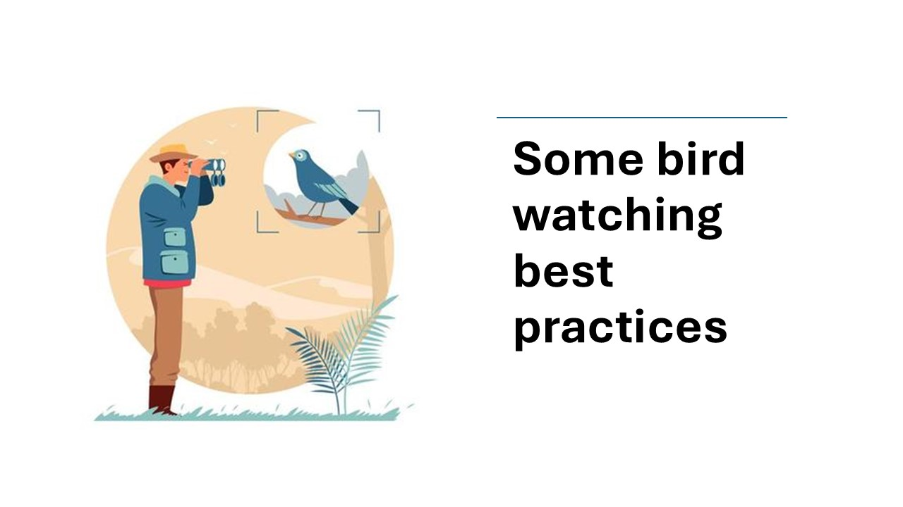 


```

------------------------------------------------------------------------

### **Keep distance when waching birds**

```{r imagens B}

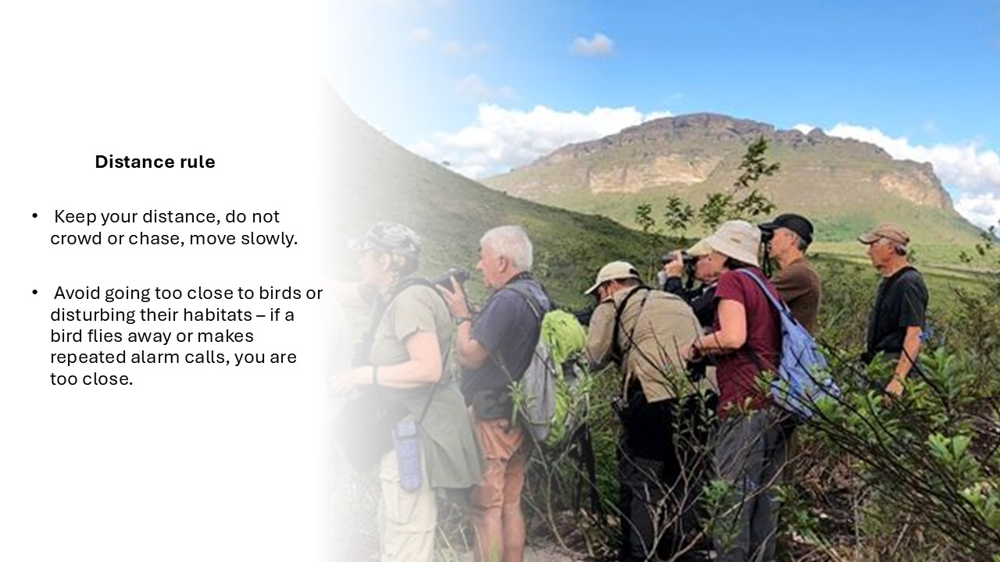


```

------------------------------------------------------------------------

### **Don't feed wild birds**

```{r imagens C}

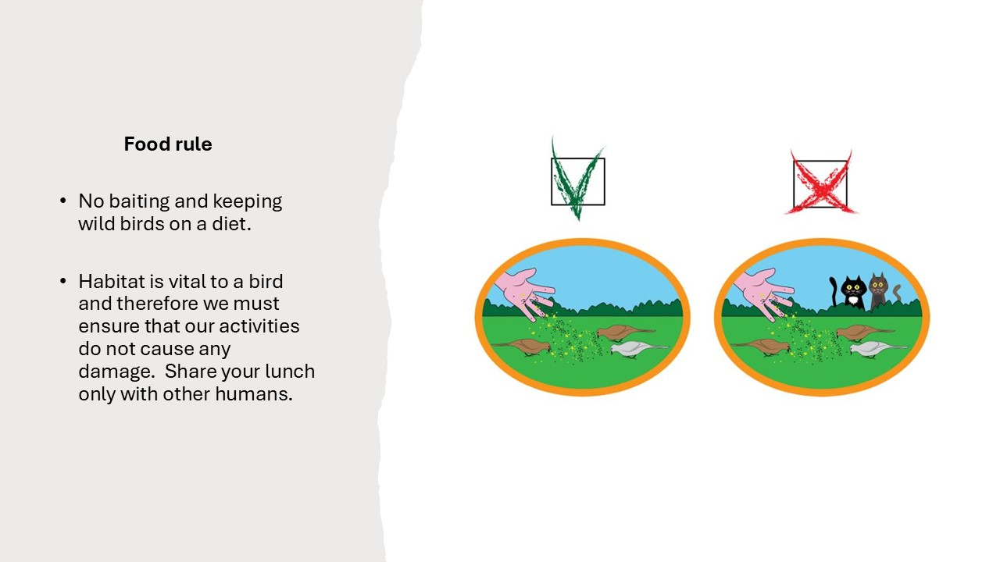 


```

### **Be careful when taking pictures**

```{r imagens D}

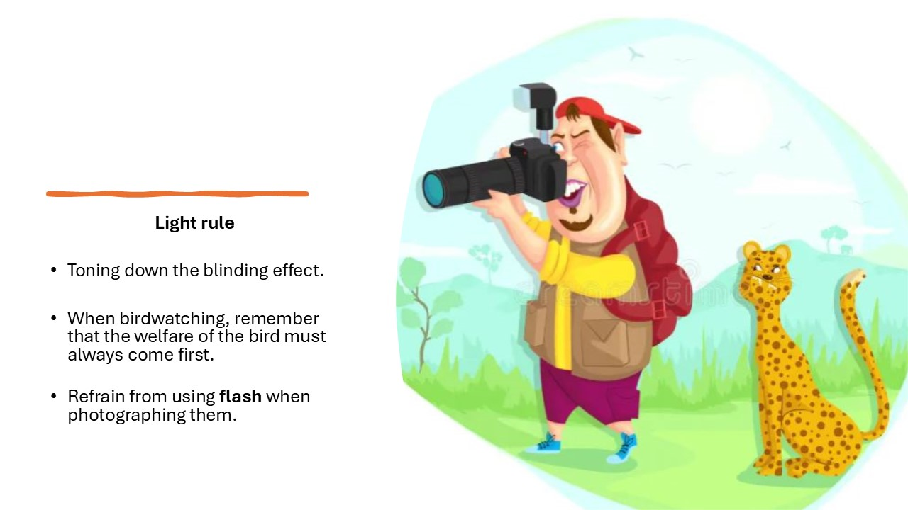 


```

### **Leave no trace**

```{r imagens E}

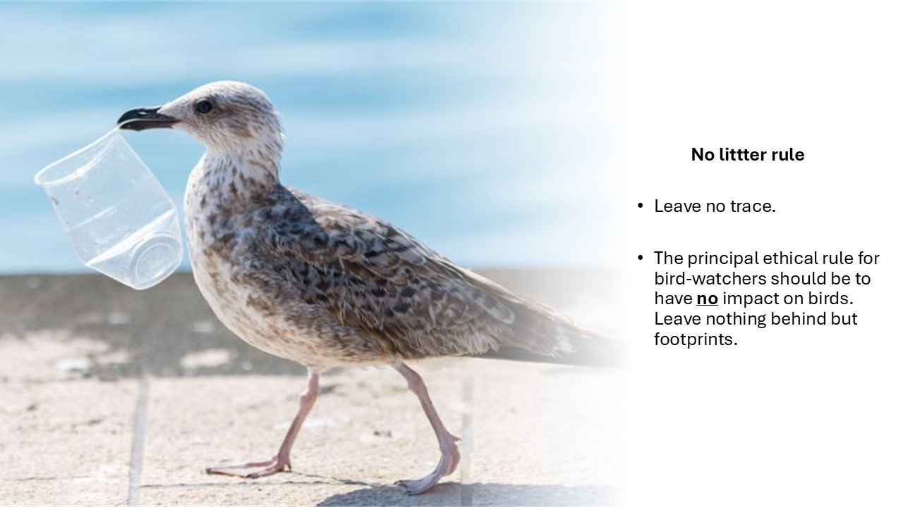 


```

### **Have fun!!**

```{r imagens F}

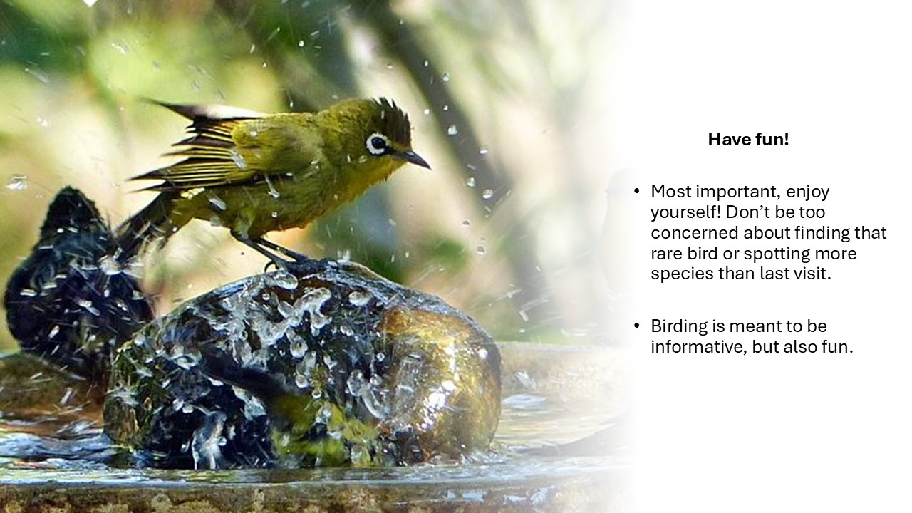 


```

### **Curiosities about Brazilian birds**

```{r imagens G}

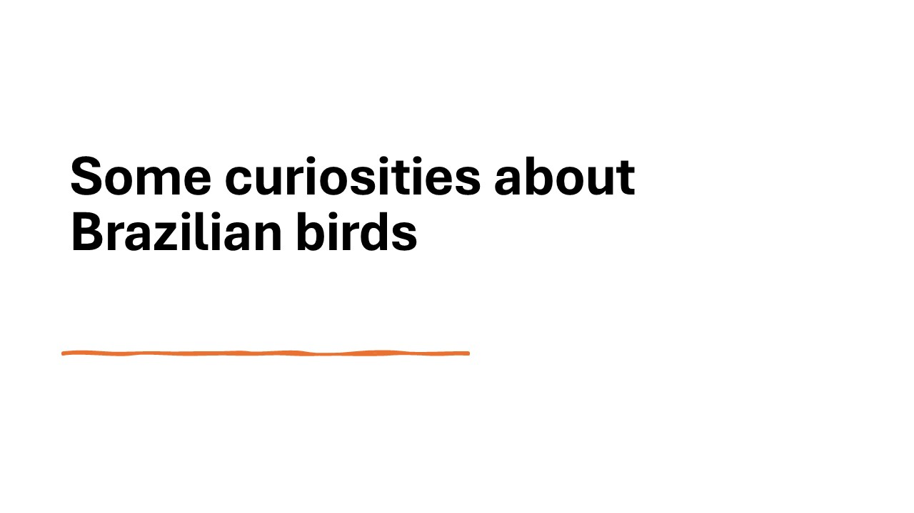 


```

### **Largest Brazilian bird**

```{r imagens H}

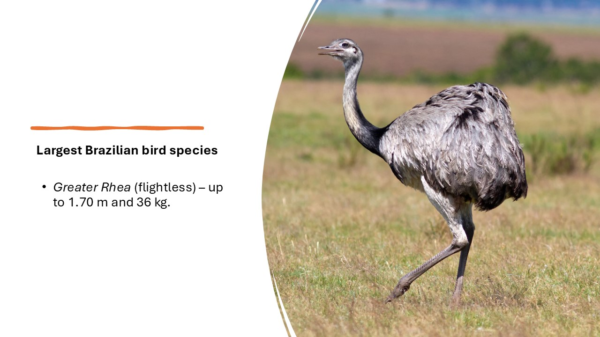 


```


### **Largest Brazilian flying bird**

```{r imagens I}

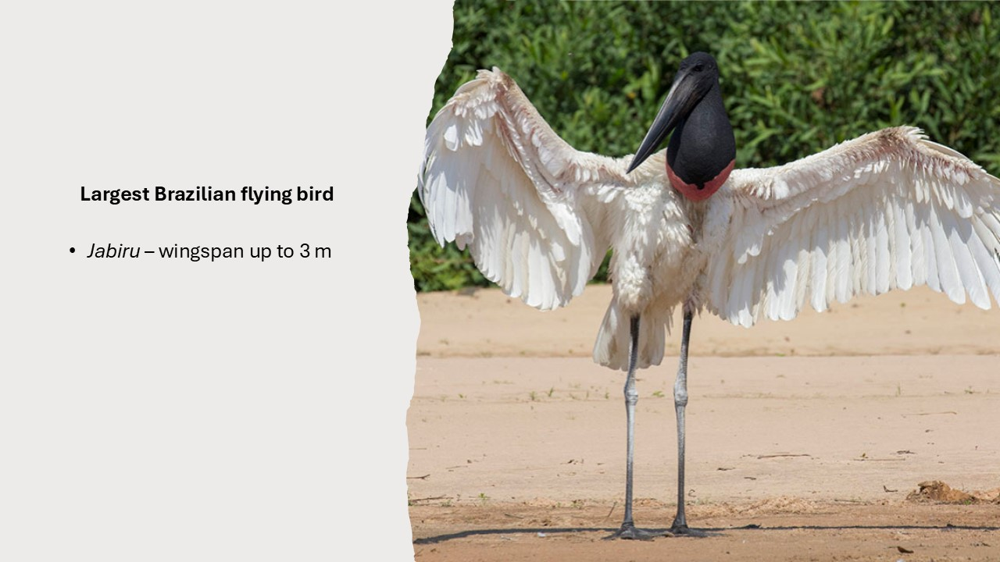 


```

### **National bird of Brazil**

```{r imagens J}

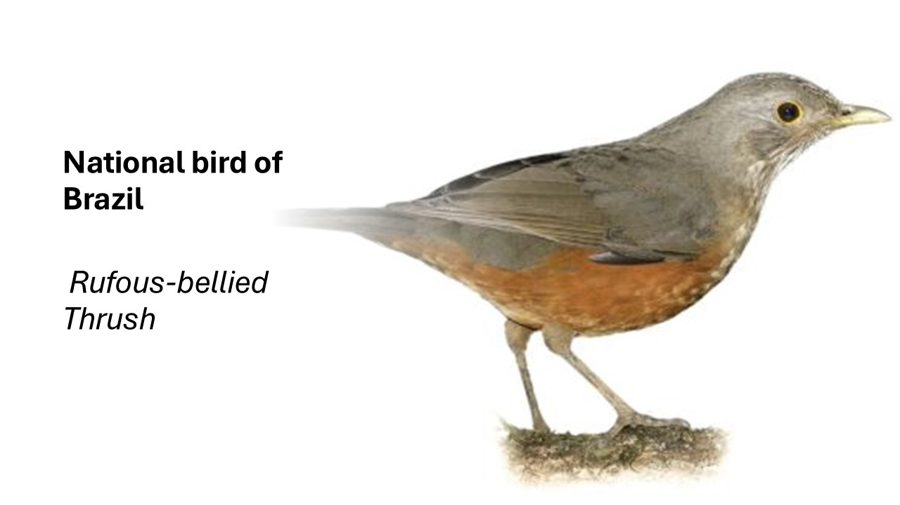 


```


### **Threatened birds in Brazil**

```{r imagens K}

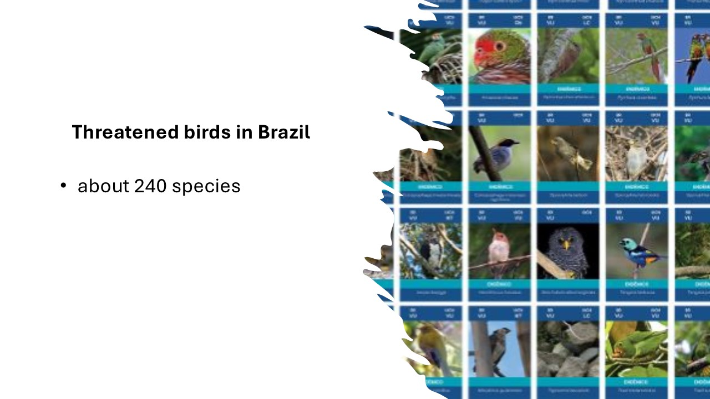 


```

### **Largest Brazilian owl**

```{r imagens L}

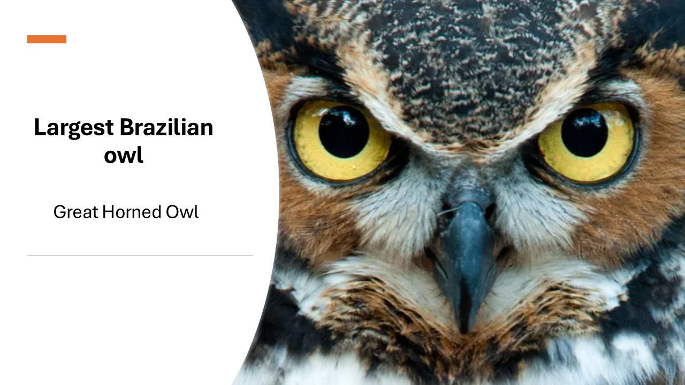 


```


### **Most trafficked bird species in Brazil**

```{r imagens M}

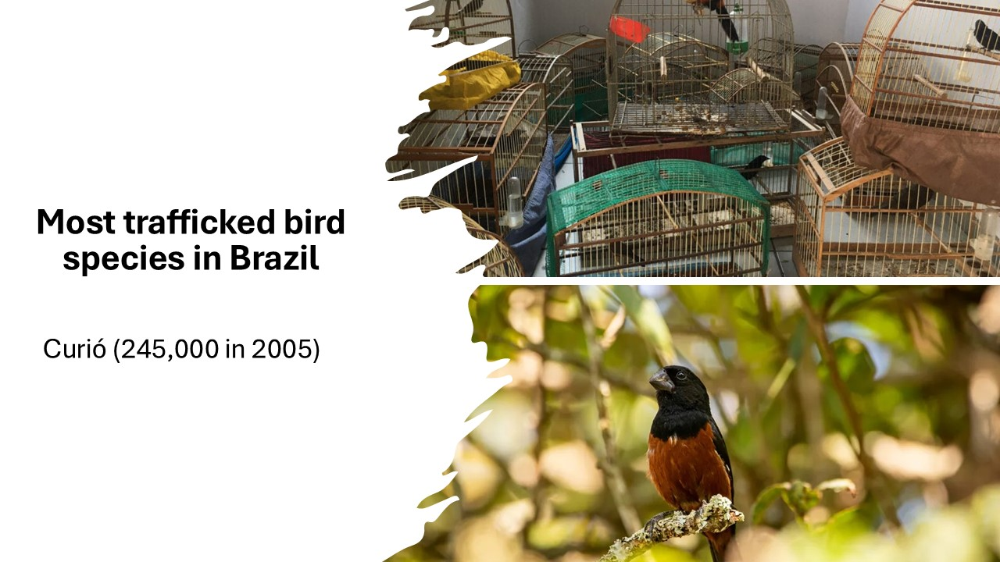 


```


### **Number ofmigratory birds in Brazil**

```{r imagens N}

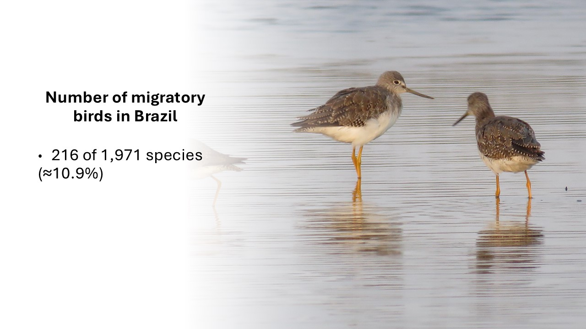 


```

# Acknowlegements {data-orientation="columns"}

## Column-1 {data-width="1000"}


### **Cornell Lab - Birds of the World**

<br/>

<center>

<br/>
<br/>
<br/>
<br/>
<br/>
<br/>
<br/>
<br/>
<br/>
<br/>
<br/>
<br/>


{width="50%" height="50%"}
</center>

<br/>

